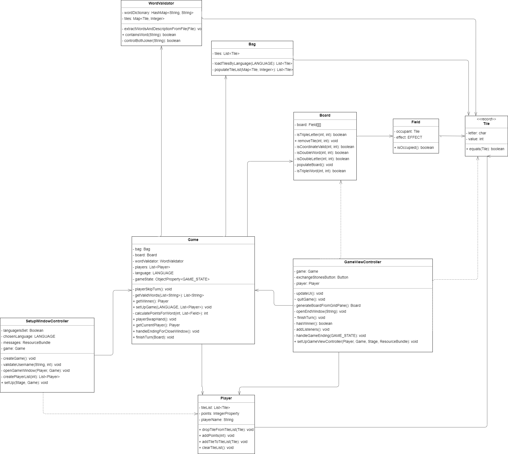

<h1 align="center"> Scrabble </h1>  

## Table of Contents

- [Introduction](#introduction)
- [Getting started](#Getting-started)
    - [How to play](#How-to-play)
    - [Requirements](#Requirements)
    - [How to run](#How-to-run)
    - [How to play](#How-to-play)
- [Architecture](#Architecture)
- [Internal Coding Agreements](#Internal-Coding-Agreements)
    - [Branching Model](#Branching-Model)
    - [Language (Documentation and Code)](#Language-Documentation-and-Code)
    - [Issues](#Issues)
- [Example Pull-Requests](#Example-Pull-Requests)
- [Number of hours used for the project](#Number-of-hours-used-for-the-project)
- [Class diagram](#class-diagram)
- [Contributors](#contributors)

## Getting started

### Requirements

A running java installation

### How to run

1. Clone the repository
2. Open the project in your IDE or Console
3. run `gradle build`
4. run `gradle run`

### How to play

### Setup Window

In the setup window you can change the language. The available languages are German and English.
You can set the number of players. Between 2 and 4 players can play. Then you write down the names of the players.
When all these settings are made, the game can be started.

### Game Window

In the GameWindow you can play Scrabble. With drag and drop you can place the tiles on the field.
With the button "Set tiles" you can set your tiles. You can also exchange all your tiles with the bank by clicking
the "Exchange tiles" button. You can always end your turn by clicking the "End turn" button.
At any time you can ask for the rules of the game by clicking the "Show help" button in the upper left corner.
Right next to it, you can end the game before the end for all players with the "End" Button.

### Rules

1. Each player draws seven letter tiles from the bag and places them on their game board.
2. The player who starts places a word on the board.
3. The next player must build off of an existing word.
4. Words can only be placed horizontally or vertically.
5. Words must be spelled correctly and in the right order.
6. Letters cannot be skipped over.
7. Words must be in the official language of the game's country.
8. Points are earned by adding up the point value of each letter in the word.
9. Bonus points are earned for using special marked squares.
10. The game ends when there are no more letter tiles left in the bag or all players have passed in succession.

## Architecture

We decided to completely decouple our frontend from our backend.
This allows us to reuse the backend for future frontends which also means that it may be possible for
players to play with each other while interfacing with the game using different frontend solutions altogether.
Static values which are used across the project are stored in the Config class in its own package.
This makes adjusting game variables much easier since we can adjust game defining values such as the size of a game
field,
the supported languages or the points which are allocated for each letter in a central location.

### Backend
The backend consists of the Game class and as well as the Model classes Bag, Board, Field, Player and Tile.
The Game class represents a single Scrabble game and determines the game process.
Each game reference owns its own board instance, represented by the Board class, a List of Players as well as a Bag.

**The Board class** is responsible for storing and manipulating the game field which is implemented as a 2-dimensional array
of Field-Elements.

**The Field class** represents a single Field on the Scrabble board. It can have an occupant in the form of a Tile element. 
The Field also stores the effect which is to be applied to letters and words which cover the field.

**The Tile record** is a simple record storing the letter and points to be handed out for using this tile.

**The Player class** is responsible for storing everything regarding a single players data such as his username, the points
which have been achieved and a list of Tiles which represents the players hand.

**The Bag class** is acting as the digital equivalent of the bag containing tiles in the real scrabble.
The Tiles get added to the Bag on creation according to the language which was set in the constructor. The information
regarding amount of letters and points per letter is stored in the config file.

### Frontend
For the prototype we have decided to implement a simple frontend using JavaFX.
There are 3 FXML files to be found under resources/view. The Controllers are packaged in the Controller package.

**SetupWindow** contains the UI elements for the first window which allows the user to choose the amount of players and the language to be played in.
When all the arguments have been entered and satisfy the specified requirements, the creation of a Game Object is called and the GameView window is opened.

**GameViewWindow** contains the main view which allows the users to interface with the game object. Listeners bind the UI elements to the Properties of the Game object and update
the view when the corresponding Property in the backend has been updated.

**HelpView** is a minimal help menu which displays the rules for the game. It can be called at any time in the GameView by choosing the Help menu in the menu bar at the top.

## Internal Coding Agreements

### Branching Model

There are two write protected branches which can only be accessed by way of a pull request. The main branch is thought
of as the productive branch and the dev branch is used to synchronise the development efforts of the individual
contributors. To implement a new feature, we require that a new feature branch is created. To get a pull request
accepted into the dev branch, the feature needs to be clean and documented.

### Language (Documentation and Code)

- English

### Issues

- Create GitHub issues for every bug, feature, refactor and testing
- Always use GitHub Issue Templates
- Add issues to the associated pull request
- Create a separate branch in each issue directly from the issue.
  So each issue has a branch with the name numberOfTheIssue-nameOfTheIssue.

## Example Pull-Requests

1. [Fix minor errors](https://github.zhaw.ch/PM2-IT22aWIN-fame-mach-dihl/team04-PAPI-projekt2-Scrabble/pull/56)
2. [62 distribution of the game tiles at the beginning](https://github.zhaw.ch/PM2-IT22aWIN-fame-mach-dihl/team04-PAPI-projekt2-Scrabble/pull/63)

## Number of hours used for the project

- Ivan Starčevic:
- Phillip Kiss:
- Raphael Meierhans:
- Tim Müller:

## Class diagram

## Contributors

[Tim Müller](https://github.zhaw.ch/muellti3) \
[Raphael Meierhans](https://github.zhaw.ch/meierr06)\
[Ivan Starčević](https://github.zhaw.ch/starciva) \
[Philipp Kiss](https://github.zhaw.ch/kisphi01)

